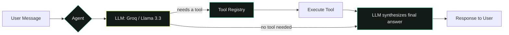

<div align="center">


<br/>


**A tool-calling AI agent that answers with live, real-world data — calculations, weather, crypto & stock prices, currency conversion, PDF summaries, and more.**

<div>

[](https://ai-agent-ayushxdev.vercel.app/)
[](https://github.com/ayushxdev01/Ai_Agent/issues)
[](https://github.com/ayushxdev01/Ai_Agent/issues)

</div>

</div>

<br/>

<div align="center">

</div>

## ✨ Overview

**AI Agent** is a full-stack, tool-calling conversational assistant. It uses an LLM (via [Groq](https://groq.com)) as its reasoning engine and a registry of Python tools to fetch **live, real-world data** — instead of hallucinating answers, it calls the right tool and responds with facts.

The frontend is a single-page dashboard with a glowing dark UI, live tool indicators, image rendering, and PDF upload support.

<br/>

## 🧰 Tools

<div align="center">

| Tool | What it does |
|---|---|
| 🧮 **Calculator** | Arithmetic, percentages, multi-step math |
| 🕐 **Time** | Current local time |
| ⛅ **Weather** | Live city weather |
| 💱 **Currency Converter** | Real-time exchange rates (any currency, name or code) |
| 📖 **Wikipedia** | Quick factual lookups |
| 📏 **Unit Converter** | km ↔ miles, kg ↔ lbs, °C ↔ °F, etc. |
| 🔍 **Web Search** | Live web results via DuckDuckGo |
| 📈 **Stock Price** | Live stock prices (US + NSE, by name or ticker) |
| 🪙 **Crypto Price** | Live cryptocurrency prices |
| 🔳 **QR Code** | Generates a QR code from any text/URL |
| 🐙 **GitHub Info** | User & repository lookups |
| 📚 **Dictionary** | English word definitions |
| 🎬 **Movie Info** | Plot, cast, ratings via OMDb |
| 📄 **PDF Summarizer** | Upload a PDF, ask questions or get a summary |

</div>

<br/>

## 🖥️ Preview

<div align="center">

</div>

<br/>

## 🏗️ Tech Stack

<div align="center">


</div>

<br/>

## 📂 Project Structure

```
session 2/
├── static/
│   └── index.html          # Frontend dashboard (single file: HTML+CSS+JS)
├── tools/
│   ├── calculator.py
│   ├── time_tool.py
│   ├── weather.py
│   ├── currency_converter.py
│   ├── wikipedia_tool.py
│   ├── unit_converter.py
│   ├── web_search.py
│   ├── stock_price.py
│   ├── qr_code.py
│   ├── crypto_price.py
│   ├── github_info.py
│   ├── dictionary.py
│   ├── movie_info.py
│   └── registry.py         # Central tool registry
├── agent.py                 # Core agent loop (LLM ↔ tool orchestration)
├── llm.py                   # Groq API wrapper
├── memory.py                 # Conversation memory (temp-dir based)
├── parser.py                 # Extracts tool calls from LLM output
├── prompts.py                # System prompt + tool descriptions
├── config.py                 # Env var loading
├── server.py                  # FastAPI app + routes
├── requirements.txt
└── .env.example
```

<br/>

## 🚀 Getting Started

### 1. Clone the repo

```bash
git clone https://github.com/ayushxdev01/Ai_Agent.git
cd Ai_Agent
```

### 2. Create a virtual environment

```bash
python -m venv venv
venv\Scripts\activate        # Windows
source venv/bin/activate     # macOS/Linux
```

### 3. Install dependencies

```bash
pip install -r requirements.txt
```

### 4. Set up environment variables

Copy `.env.example` → `.env` and fill in your keys:

```env
GROQ_API_KEY=your_groq_key_here
OMDB_API_KEY=your_omdb_key_here
```

Get a free Groq key at [console.groq.com](https://console.groq.com/keys) and a free OMDb key at [omdbapi.com](https://www.omdbapi.com/apikey.aspx).

### 5. Run the server

```bash
uvicorn server:app --reload --port 8000
```

Open **http://127.0.0.1:8000** in your browser. 🎉

<br/>

## ☁️ Deployment

<div align="center">

[](https://vercel.com/new)

**🔴 Live at: [ai-agent-ayushxdev.vercel.app](https://ai-agent-ayushxdev.vercel.app/)**

</div>

Connect your GitHub repo to Vercel and add the environment variables from `.env.example` in the project dashboard.

> ⚠️ **Note:** Vercel's filesystem is read-only, so features like image generation return inline base64 data instead of saved files, and conversation memory is stored in the OS temp directory rather than persisted permanently.

<br/>

## 🧠 How It Works



1. User sends a message
2. The LLM decides: answer directly, or request a tool (returns structured JSON)
3. If a tool is requested, the agent executes it and feeds the result back to the LLM
4. The LLM synthesizes a final, natural-language response
5. Everything is saved to conversation memory for context in future turns

<br/>

## 🤝 Contributing

Contributions, issues, and feature requests are welcome!

1. Fork the repo
2. Create your feature branch (`git checkout -b feature/amazing-tool`)
3. Commit your changes (`git commit -m 'Add amazing tool'`)
4. Push to the branch (`git push origin feature/amazing-tool`)
5. Open a Pull Request

<br/>

## 📜 License

Distributed under the MIT License. See `LICENSE` for more information.

<br/>

## 👤 Author

<div align="center">

**Ayush Gupta**

[](https://github.com/ayushxdev01)


</div>

<br/>

<div align="center">

### ⭐ If you found this project useful, consider giving it a star!


</div>